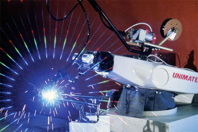
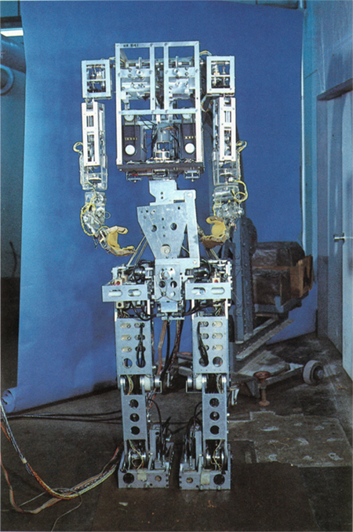
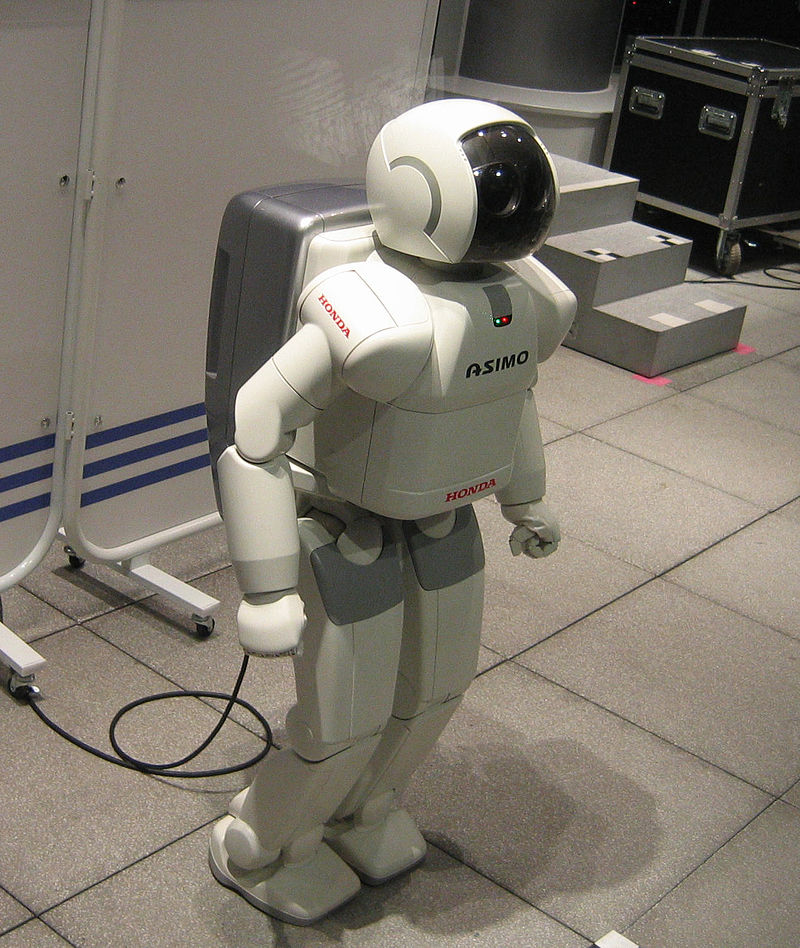
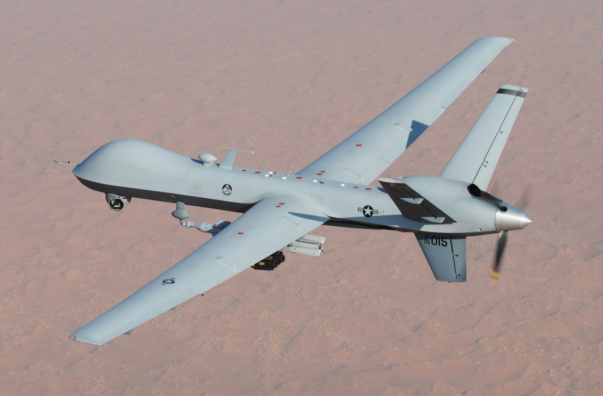

[//]: # (This may be the most platform independent comment)

# 1: Intro to Robotics (and Autonomous Racing)
Welcome! This is the first introduction to the world of robotics (especially autonomous vehicles).

This section will go over the following topics:
- [Robot: Dictionary Definition](https://github.com/daia99/TCD-FS-AI-Autonomous-Racing/blob/master/Learning/Self-Deep-Learning/1-Intro-to-Robotics-Racing.md#robot-dictionary-definition)
- [Robot: Cool Examples](https://github.com/daia99/TCD-FS-AI-Autonomous-Racing/blob/master/Learning/Self-Deep-Learning/1-Intro-to-Robotics-Racing.md#robot-cool-examples)
- [Robot: Impact on Society](https://github.com/daia99/TCD-FS-AI-Autonomous-Racing/blob/master/Learning/Self-Deep-Learning/1-Intro-to-Robotics-Racing.md#robot-impact-on-society)
- [Robot: Ethics and Safety](https://github.com/daia99/TCD-FS-AI-Autonomous-Racing/blob/master/Learning/Self-Deep-Learning/1-Intro-to-Robotics-Racing.md#robot-ethics-and-safety)
- [Robot: Self-Driving (Autonomous) Car](https://github.com/daia99/TCD-FS-AI-Autonomous-Racing/blob/master/Learning/Self-Deep-Learning/1-Intro-to-Robotics-Racing.md#robot-self-driving-autonomous-car)
- [Future Development of Autonomous Racing](https://github.com/daia99/TCD-FS-AI-Autonomous-Racing/blob/master/Learning/Self-Deep-Learning/1-Intro-to-Robotics-Racing.md#future-development-of-autonomous-racing)

## Robot: Dictionary Definition
According to Google, the definition for robot is:
> (especially in science fiction) a machine resembling a human being and able to replicate certain human movements and functions automatically.

The other, more applicable definition for robot:
> a ***machine*** capable of carrying out a complex series of actions ***automatically***, especially one ***programmable by a computer***.

#### What does this mean?
A robot is not an assembly of moving parts, or a computer.

A robot is a complex body with a brain (computer) giving it adaptable intelligence to change the physical world. Body and mind working together.

#### Reference
[Article](https://robots.ieee.org/learn/what-is-a-robot/) from IEEE with expert perspectives on robots

## Robot: Cool Examples
| Unimate (1954) | WABOT-1 (1972) | Asimo v1 (2000) | MQ-9 Reaper |
| :---: | :---: | :---: | :---: |
|  |  |  |  |
| :---: | :---: | :---: | :---: |
| First industrial robot | First android | Early bipedal social robot (cobot) | Autonomous military drone |

## Robot: Impact on Society
## Robot: Ethics and Safety
## Robot: Self-Driving (Autonomous) Car
## Future Development of Autonomous Racing
