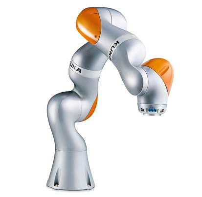

[//]: # "This may be the most platform independent comment"

# 1: Intro to Robotics (and Autonomous Racing)
Welcome! This is the first introduction to the world of robotics (especially autonomous vehicles).

This section will go over the following topics:
- [Robot: Dictionary Definition](https://github.com/daia99/TCD-FS-AI-Autonomous-Racing/blob/master/Learning/Self-Deep-Learning/1-Intro-to-Robotics-Racing.md#robot-dictionary-definition)
- [Robot: Cool Examples](https://github.com/daia99/TCD-FS-AI-Autonomous-Racing/blob/master/Learning/Self-Deep-Learning/1-Intro-to-Robotics-Racing.md#robot-cool-examples)
- [Robot: Impact on Society](https://github.com/daia99/TCD-FS-AI-Autonomous-Racing/blob/master/Learning/Self-Deep-Learning/1-Intro-to-Robotics-Racing.md#robot-impact-on-society)
- [Robot: Ethics and Safety](https://github.com/daia99/TCD-FS-AI-Autonomous-Racing/blob/master/Learning/Self-Deep-Learning/1-Intro-to-Robotics-Racing.md#robot-ethics-and-safety)
- [Robot: Self-Driving (Autonomous) Car](https://github.com/daia99/TCD-FS-AI-Autonomous-Racing/blob/master/Learning/Self-Deep-Learning/1-Intro-to-Robotics-Racing.md#robot-self-driving-autonomous-car)
- [Future Development of Autonomous Racing](https://github.com/daia99/TCD-FS-AI-Autonomous-Racing/blob/master/Learning/Self-Deep-Learning/1-Intro-to-Robotics-Racing.md#future-development-of-autonomous-racing)

## Robot: Dictionary Definition
According to Google, the definition for robot is:
> (especially in science fiction) a machine resembling a human being and able to replicate certain human movements and functions automatically.

The other, more applicable definition for robot:
> a ***machine*** capable of carrying out a complex series of actions ***automatically***, especially one ***programmable by a computer***.

#### What does this mean?
A robot is not an assembly of moving parts, or a computer.

A robot is a complex body with a brain (computer) giving it adaptable intelligence to change the physical world. Body and mind working together.

#### Reference
[Article](https://robots.ieee.org/learn/what-is-a-robot/) from IEEE with expert perspectives on robots

## Robot: Cool Examples
| Unimate (1954) | WABOT-1 (1972) |                  MQ-9 Reaper                  |              Harvard Soft Exosuit              |
| :---: | :---: | :---: | :---: |
|  |  |  |  |
| First industrial robot | First android |           Autonomous military drone           | Soft Robot Application   (Walking Aid) |

| Ion Surgical System | Spot (Boston   Dynamics) | KUKA LBR iiwa | Particle robots |
| :---: | :---: | :---: | :---: |
|  |  |  |  |
| Bronchoscopy robot | Mobile robot dog | Safe industrial cobot | Biologically inspired   concept |

## Robot: [Ethics](https://www.ieee-ras.org/robot-ethics) and Safety

Many aspects of a robot challenge our ability to deal with the security issues and ethical dilemmas involved. Especially when potential dangers can undermine progress in applying new robots to society.

When designing robots, edge cases and vulnerabilities must be resolved so as to improve end-user experience and acceptance of robots in everyday life.

#### Physical Safety Concerns

- [Workplace Safety](https://en.wikipedia.org/wiki/Workplace_robotics_safety)
- [Factory Robot Accident - Room for Cobots](https://www.ft.com/content/0c8034a6-200f-11e5-aa5a-398b2169cf79)
- [Medical Robot Safety Review](https://www.technologyreview.com/2015/07/20/110174/robotic-surgery-linked-to-144-deaths-since-2000/)

#### Cybersecurity Issues

- [Industrial Robot Security](https://www.robotics.org/blog-article.cfm/Overcoming-Industrial-Robot-Security-Threats/200)
- [EU Report: Privacy, Data Protection](https://edps.europa.eu/sites/edp/files/publication/16-10-19_marrakesh_ai_paper_en.pdf)
- [Deepfake](https://en.wikipedia.org/wiki/Deepfake)
- [Ethics of AI and Robotics (Stanford Encyclopedia of Philosophy)](https://plato.stanford.edu/entries/ethics-ai/)

## Robot: Self-Driving (Autonomous) Car
## Future Development of Autonomous Racing
